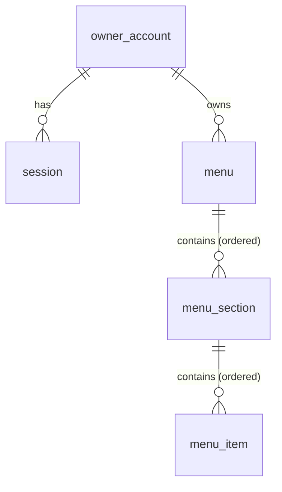

# Data Model: Base Menu Creation & Publishing

**Date**: 2026-08-31 | **Plan**: [plan.md](./plan.md) | **Research**: [research.md](./research.md)

PostgreSQL is the system of record. Every invariant below is enforced *in the database* (NOT NULL, FK, CHECK, UNIQUE) per API constitution V; application-level validation (see [contracts/http-api.md](./contracts/http-api.md)) is the friendly first line, the schema is the guarantee. All schema changes ship as versioned drizzle-kit migrations.

## Entity Overview



## Tables

### owner_account

Restaurant owner identity (spec: Owner Account).

| Column | Type | Constraints | Notes |
|---|---|---|---|
| id | uuid | PK, default `gen_random_uuid()` | |
| email | text | NOT NULL | Stored as entered; uniqueness is case-insensitive |
| password_hash | text | NOT NULL | Argon2id PHC string (R2) |
| created_at | timestamptz | NOT NULL, default `now()` | |

**Indexes**: `UNIQUE INDEX owner_account_email_lower_idx ON owner_account (lower(email))` — enforces FR-003 (one account per email, case-insensitive) in the database.

**Validation (boundary)**: email must match a standard email format; password ≥ 8 characters (FR-002). Password is never stored or logged in plaintext.

### session

Authenticated session (R2). Not visible in any API payload.

| Column | Type | Constraints | Notes |
|---|---|---|---|
| id | uuid | PK, default `gen_random_uuid()` | |
| account_id | uuid | NOT NULL, FK → owner_account(id) ON DELETE CASCADE | |
| token_hash | text | NOT NULL, UNIQUE | SHA-256 of the opaque cookie token; raw token never stored |
| expires_at | timestamptz | NOT NULL | 30-day rolling expiry; expired rows are ignored by the guard and purgeable |
| created_at | timestamptz | NOT NULL, default `now()` | |

**Index**: lookup is by `token_hash` (covered by the UNIQUE index).

### menu

A named, publishable collection of sections (spec: Menu).

| Column | Type | Constraints | Notes |
|---|---|---|---|
| id | uuid | PK, default `gen_random_uuid()` | |
| account_id | uuid | NOT NULL, FK → owner_account(id) ON DELETE CASCADE | FR-005 ownership |
| name | text | NOT NULL, CHECK (`char_length(name) BETWEEN 1 AND 120`) | |
| status | text | NOT NULL, DEFAULT `'draft'`, CHECK (`status IN ('draft','published')`) | New menus start unpublished (FR-006) |
| visual_variant | text | NOT NULL, DEFAULT `'default'` | Stub — API allowlist contains only `'default'` (FR-010, R11) |
| public_slug | text | UNIQUE, NULL | NULL until first publish; assigned once, never changed (R5) |
| created_at | timestamptz | NOT NULL, default `now()` | |
| updated_at | timestamptz | NOT NULL, default `now()` | Touched on any content change (menu/section/item) |

**Indexes**: `(account_id)` for the workspace list; UNIQUE on `public_slug` (partial, `WHERE public_slug IS NOT NULL`).

### menu_section

Titled, ordered grouping within a menu (spec: Menu Section).

| Column | Type | Constraints | Notes |
|---|---|---|---|
| id | uuid | PK, default `gen_random_uuid()` | |
| menu_id | uuid | NOT NULL, FK → menu(id) ON DELETE CASCADE | Deleting a menu removes all content (FR-013) |
| title | text | NOT NULL, CHECK (`char_length(title) BETWEEN 1 AND 120`) | |
| position | integer | NOT NULL | Sibling order; reads sort by `(position, id)`; renumbered transactionally on reorder (R8) |
| created_at | timestamptz | NOT NULL, default `now()` | |

**Index**: `(menu_id, position)`.

### menu_item

A single offering (spec: Menu Item).

| Column | Type | Constraints | Notes |
|---|---|---|---|
| id | uuid | PK, default `gen_random_uuid()` | |
| section_id | uuid | NOT NULL, FK → menu_section(id) ON DELETE CASCADE | Deleting a section removes its items (edge case: confirmed in UI) |
| name | text | NOT NULL, CHECK (`char_length(name) BETWEEN 1 AND 200`) | FR-009: name required |
| description | text | NULL, CHECK (`description IS NULL OR char_length(description) <= 2000`) | Optional (FR-008) |
| price_czk | integer | NOT NULL, CHECK (`price_czk >= 0`) | Whole CZK, major units (R7); FR-009 non-negative |
| position | integer | NOT NULL | Sibling order within the section (R8) |
| created_at | timestamptz | NOT NULL, default `now()` | |

**Index**: `(section_id, position)`.

## State Transitions

`menu.status` is the only stateful field:

```text
            publish (assigns public_slug on first transition only)
  ┌────────┐ ───────────────────────────────────────────────► ┌───────────┐
  │ draft  │                                                  │ published │
  └────────┘ ◄─────────────────────────────────────────────── └───────────┘
            unpublish (public_slug retained — address is stable)
```

- **draft → published**: owner-only. First publish generates `public_slug`; republish reuses it (R5, FR-014).
- **published → draft**: owner-only. Public endpoint stops serving the slug on the next request (FR-016). Slug remains reserved.
- **Content edits** are allowed in either state; in `published` they are publicly visible on subsequent requests (FR-020) — there is no draft/live snapshot split (spec assumption).
- **Delete** is allowed in either state (FR-013); cascades remove sections, items, and public availability (the slug row disappears; the address 404s).

## Invariants & Access Rules

- Every menu/section/item read or mutation on owner endpoints is scoped by `account_id` resolved from the session — a menu that exists but belongs to someone else behaves exactly like a missing one (404, no existence leak; FR-005, US3/AS5).
- The public read path selects only `status = 'published'` by `public_slug` and returns only display fields (no ids of the owner, no account data; FR-015, FR-018).
- Empty menus/sections are valid at every stage, including published (edge case: publishing an empty menu succeeds).
- Bounded responses: sections and items are only ever fetched per-menu (naturally bounded); defensive `LIMIT` caps (e.g. 100 sections / 1000 items per menu read) back the constitution's no-unbounded-queries rule.

## Mapping to the Frontend Display Model

The public payload (see contract) is deliberately smaller than the design system's `Menu` model (`apps/frontend/lib/design-system/types.ts`). `lib/menu-display/adapter.ts` maps it:

| API public payload | Design-system model |
|---|---|
| `name` | `Menu.establishment.name` |
| `sections[].title` | `MenuCategory.name` (id = slugified title + index for anchor) |
| `sections[].items[].name/description` | `MenuItem.name/description` |
| `sections[].items[].priceCzk` | `MenuItem.price = { kind: "single", amount: { amount, currency: "CZK" } }` |
| `visualVariant` | reserved — rendering branch point when real variants ship (R11) |

Fields the display components support but this feature doesn't collect (images, dietary markers, availability, specials, opening hours) are simply absent — the components already treat them as optional.
